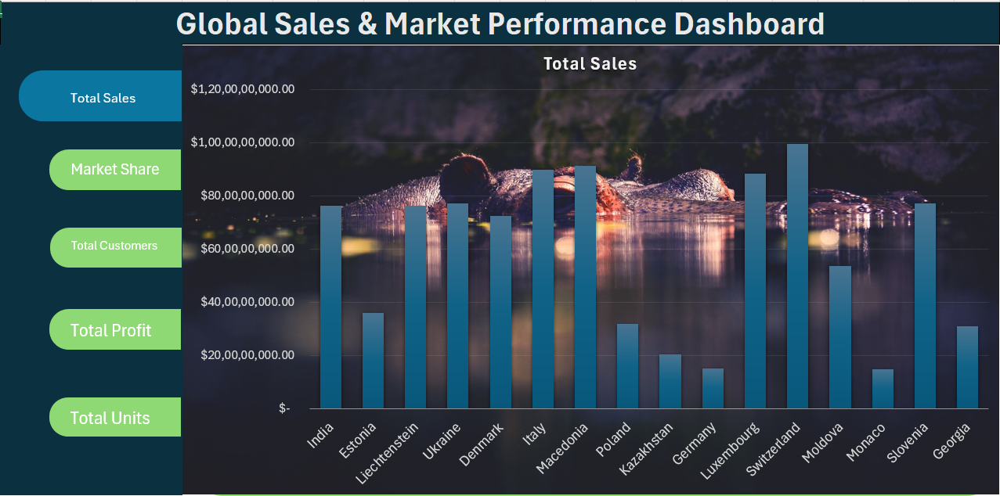
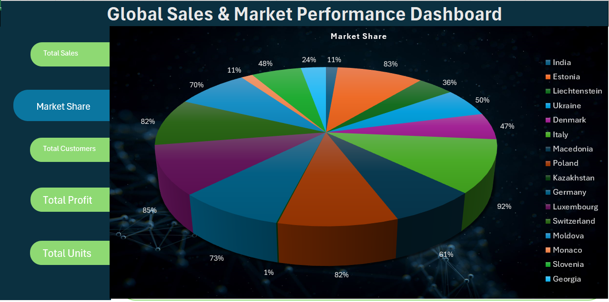
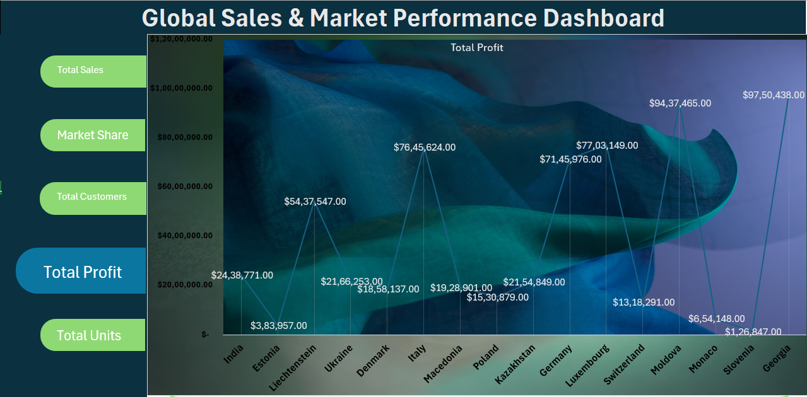
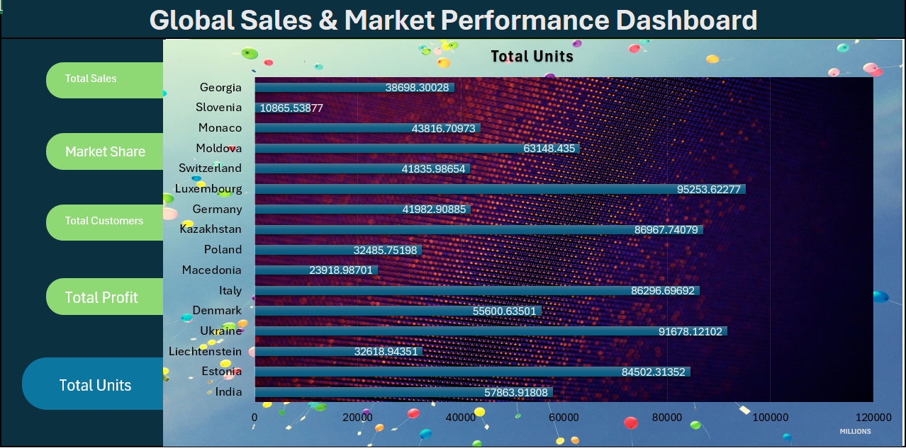
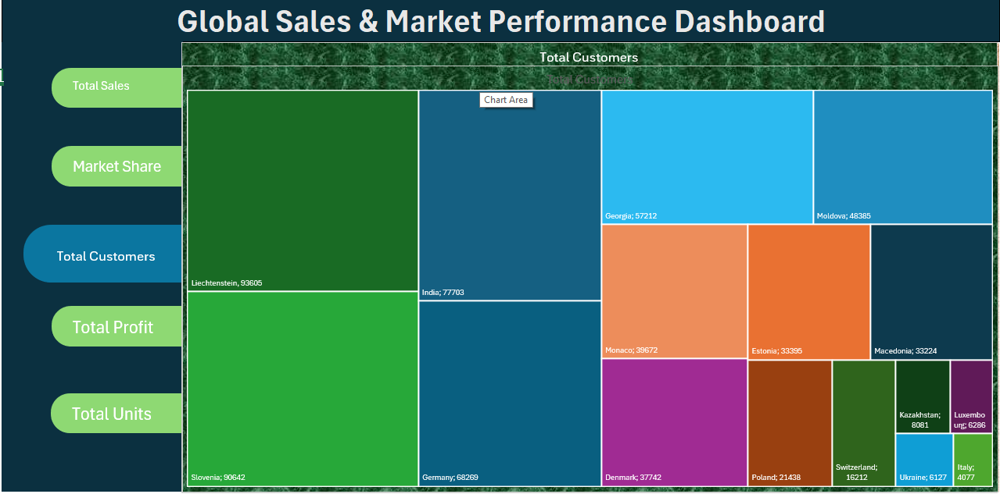

 📊 Global Sales Market Performance Dashboard  

 ## 📑 Table of Contents
- [Project Overview](#-project-overview)
- [Project Objectives](#-project-objectives)
- [Tools & Skills Used](#-tools--skills-used)
- [Hyperlink-Based Navigation](#-hyperlink-based-navigation-core-feature)
- [Key Insights Covered](#-key-insights-covered)
- [Project Structure](#-project-structure)
- [Dashboard Preview](#-dashboard-preview)
- [How to Use](#-how-to-use)
- [Business Value](#-business-value)
- [About Me](#-about-me)

An interactive **Excel-based sales analytics dashboard** designed to analyze **global sales performance, market trends, customer insights, and profitability** using advanced Excel features and dynamic hyperlinks for easy navigation.

---
🚀 Project Overview
This project showcases my **Data Analytics skills using Microsoft Excel**.  
The dashboard converts raw global sales data into **actionable business insights** and allows users to navigate across different views using **interactive hyperlinks**, slicers, and filters.

🔗 **Main highlight:**  
✔ Extensive use of **Hyperlinks** for smooth navigation between dashboard sections, reports, and insights.

---
 🎯 Project Objectives
- Analyze **total sales, profit, customers, and units sold**
- Evaluate **country-wise & market-wise performance**
- Identify **top-performing regions and customers**
- Enable **easy navigation using hyperlinks**
- Support **data-driven business decisions**

---

 🛠 Tools & Skills Used
- **Microsoft Excel**
- Pivot Tables & Pivot Charts  
- Power Query (Data Cleaning & Transformation)  
- Excel Formulas (SUMIFS, IF, VLOOKUP/XLOOKUP)  
- **Hyperlinks for report navigation**
- Slicers & Timelines  
- Data Visualization & Dashboard Design  

---
 🔗 Hyperlink-Based Navigation (Core Feature)
The dashboard uses **Excel Hyperlinks** to:
- Navigate between **Summary Dashboard & Detailed Reports**
- Jump to **Country-wise / Market-wise analysis**
- Access **KPIs and charts instantly**
- Improve user experience and report usability

---

 📈 Key Insights Covered
- Total Sales, Profit & Customers overview  
- Country-wise & Market-wise sales distribution  
- Top markets and regions performance  
- Customer contribution analysis  
- Monthly & yearly sales trends  

  

---

 📂 Project Structure
Global-Sales-Market-Performance-Dashboard/
│
├── Global_Sales_Market_Performance_Dashboard.xlsx
├── README.md
├── assets/
│ └── dashboard-preview.png

---
## 🖼 Dashboard Preview

---

## 📌 How to Use
1. Clone or download the repository  
   👉 [Download Repository](https://github.com/abhishekdud430/Global-Sales-Market-Performance-Dashboard)

2. Open the Excel dashboard file  
   Open 📥 [Download Excel Dashboard](Global_Sales_Market_Performance_Dashboard.xlsx) 

3. Use **Hyperlinks** to navigate between reports and views  

4. Apply **slicers & filters** to explore data by country, market, or year  

---

## 🎯 Business Value
- Quick monitoring of global sales performance  
- Easy navigation using hyperlinks (user-friendly design)  
- Identifies profitable markets and key customers  
- Helps management make strategic decisions  

---

## 👨‍💻 About Me
**Abhishek Kumar**  
Aspiring **Data Analyst** with hands-on experience in **Excel, SQL, Power BI, and Data Visualization**.  
Passionate about transforming raw data into meaningful insights.

🔗 **GitHub:** https://github.com/abhishekdud430  
🔗 **LinkedIn:** https://www.linkedin.com/in/abhishekkumar430

---

<a href="#-table-of-contents">⬆ Back to Top</a>

⭐ If you like this project, don’t forget to give it a star⭐

